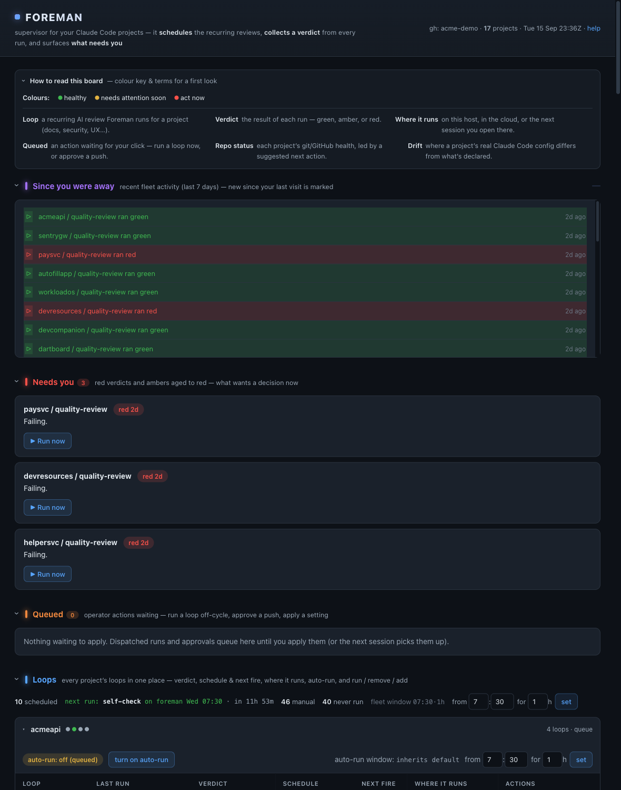
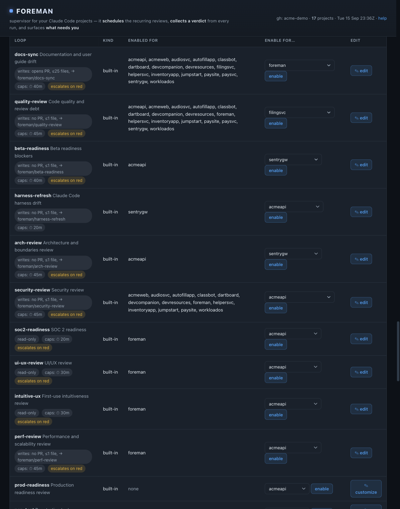
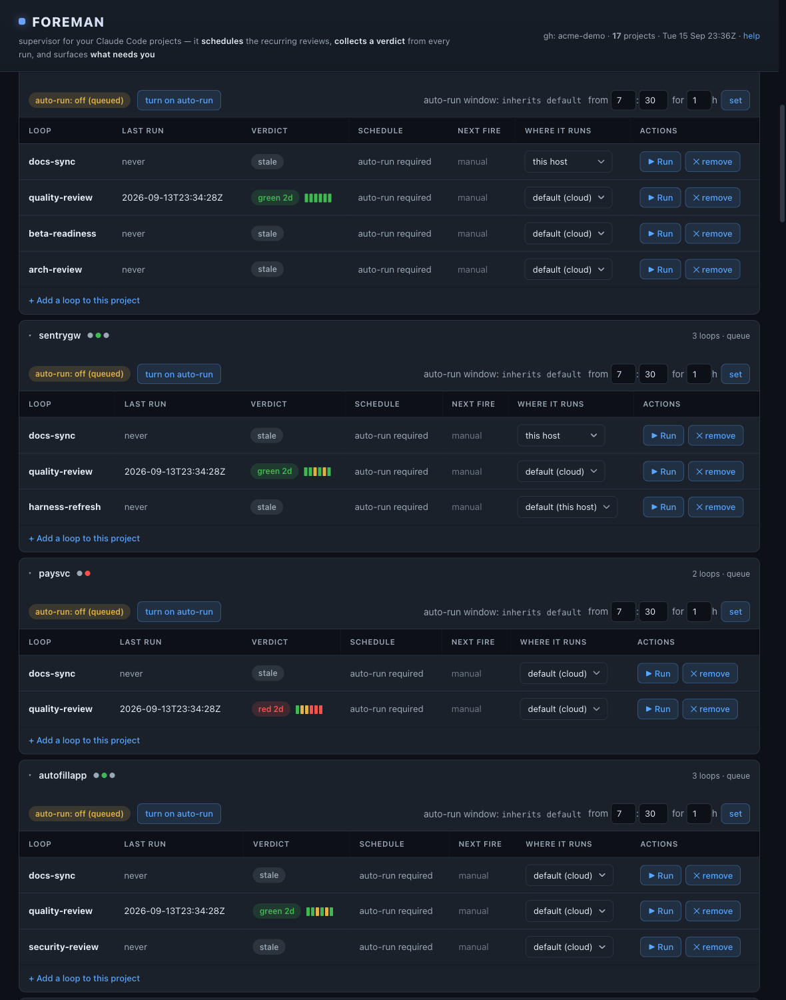
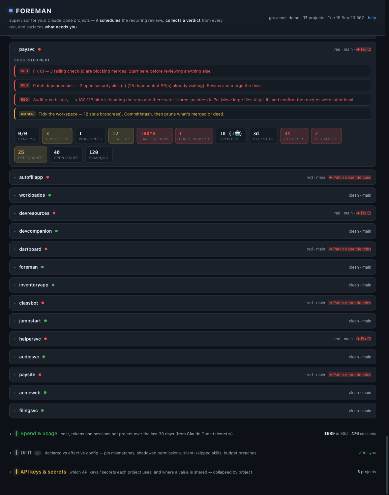

# Foreman

## Supervise everything your agents build — and prove it's healthy.

### The control plane for a portfolio of software built by coding agents

**Schedules the reviews · collects a verdict from every run · surfaces what needs you**

*schedules and reads — the prompts do the work*

---

## The shift

Coding agents made it cheap to **create and maintain far more software per person**.

So the bottleneck moved:

### from *writing code* → to **supervising many autonomous streams of it**

One operator now runs **10–30 agent-maintained projects**.
Nothing exists to keep them all healthy without babysitting each one.

---

## The problem

You have 20 repos being built and maintained by agents. Right now:

- Is each one still **documented**? **secure**? **prod-ready**? **on budget**?
- **CI only fires on commits** — and only runs *deterministic* checks.
- The interesting reviews (architecture, UX, pen-test, prod-readiness) are **open-ended judgment** no linter can make.
- Doing it by hand, per repo, every week — **doesn't scale.**

---

## What Foreman is

A **control plane** for the portfolio:

> It schedules recurring **AI reviews** across every project, reduces each run to a
> durable **🟢 / 🟡 / 🔴 verdict**, and shows the whole fleet on one board — with a
> **git-committed receipt** behind every verdict.

It is a control repo, a contract, and a small index.
**Not a daemon, not an agent runtime.** *Foreman never does the work.*

---

## One glance: catch up on the whole fleet

*"Since you were away" → what changed · "Needs you" → triage · "Queued" → one-click actions*

---

## How it works — two contracts, both in git

**Receipts** — reverse channel (app → Foreman)
every run writes the *same* JSON verdict to the `state` branch.
**A run with no receipt is red by absence** — silent failures become visible.

**Decisions** — forward channel (Foreman → app)
a call you make is queued and applied at the project's next session.

**Loops** are the unit of work: a cadence + a prompt + a verdict rule.
**Where it runs** is a tier: `local` · `cloud` · `next session`.

---

## The loop library

*docs · quality · security · soc2 · arch · perf · prod-readiness · pen-test · test · UI/UX — one-click per project, or customize / add your own*

---

## Every project's loops, in one panel

*verdict + trend sparkline · schedule & next fire · **where it runs** · run / remove / add*

---

## Fleet health at a glance

*per-project vital signs (sync · dirty · PRs · CI · security alerts) + a cross-project roll-up*

---

## The loop closes itself

🟡 **amber ages to red** → 🔴 **red opens a GitHub issue** → 🟢 **a green run closes it**
with a link to the clearing receipt.

And every verdict is a **schema-validated JSON receipt committed to git** —
a tamper-evident, versioned record of *what was reviewed, when, and how it turned out.*

---

## Why it's different — the moats

- **Receipt-as-contract, index-as-cache** — inspectable, versioned, rebuildable. Not a black box.
- **Declared ≠ effective** — it *probes* what's actually in effect and reports **config drift**. **No comparable tool does this.**
- **Portfolio + time, metered** — cloud/local/session tiers, per-run budgets, spend by project.
- **A supervisor, not a swarm** — orchestrates *when* agents run, reads *what they concluded*.

---

## The wedge: continuous assurance

The **security / soc2 / pen-test** loops **+** the **git-committed receipt history** are, together,
a record that every project was reviewed on a schedule — with every verdict and its clearing.

### That's not a nice-to-have. It's **audit evidence** — with a buyer and a budget.

---

## Where it sits

|  | **Foreman** | CI/CD | Quality SaaS | Coding agents | Swarm frameworks |
| --- | :--: | :--: | :--: | :--: | :--: |
| Unit of concern | **portfolio × time** | commit | repo | task | task |
| The check | **open-ended AI** | script | rule set | the work | the work |
| Does the work? | **no** | scripts | no | yes | yes |
| Output | **verdict** | pass/fail | findings | a diff | a result |
| Config-drift probe | **✅** | — | — | — | — |
| Audit trail in git | **✅** | partial | vendor | — | — |

---

## Who it's for

The operator — **solo builder, studio, or platform team** — running **many**
agent-maintained projects, who needs portfolio-level assurance:

> *Is every project still documented, secure, prod-ready, on budget —
> and can I prove it?*

---

## Status & honest limits

**Shipped:** M1–M8 + secrets store + full operator surface. **231 tests, ~84% coverage.**
Live as a local dashboard + a token-gated read-only hosted board.

**Limits:** deeply wired to Claude Code today (the drift probe is the ecosystem-specific moat) ·
verdicts are LLM judgments (mitigated by an independent verifier pass) ·
single-operator today, not yet multi-tenant SaaS · cloud-tier ops partly host-bound.

---

# A supervisor you can **trust** and **reconstruct**

### not an agent swarm

*README · docs/ONE-PAGER.md · docs/COMPARISON.md*
